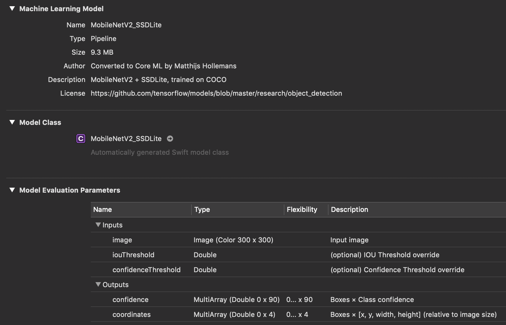

# SSDMobileNet-CoreML


This project is Object Detection on iOS with Core ML.<br>If you are interested in iOS + Machine Learning, visit [here](https://github.com/motlabs/iOS-Proejcts-with-ML-Models) you can see various DEMOs.<br>

## How it works

(preparing...)

## Requirements

- Xcode 9.2+
- iOS 11.0+
- Swift 4.2

## Download model

### Get Core ML Survival Guide's MobileNetV2+SSDLite model

SSDLite object detection model for Core ML<br>
☞ Download Core ML model([`MobileNetV2_SSDLite.mlmodel`](https://github.com/hollance/coreml-survival-guide/blob/master/MobileNetV2%2BSSDLite/ObjectDetection/ObjectDetection/MobileNetV2_SSDLite.mlmodel)) and label file([`coco_labels.txt`](https://github.com/hollance/coreml-survival-guide/blob/master/MobileNetV2%2BSSDLite/coco_labels.txt)).

#### Model Matadata



#### Inference Time

|                | MobileNetV2 SSDLite    |
| -------------- | -------- |
| iPhone XS      | (`TODO`) |
| iPhone XS Max  | (`TODO`) |
| iPhone XR      | (`TODO`) |
| iPhone X       | 100 ~ 120 ms   |
| iPhone 8       | (`TODO`) |
| iPhone 7       | (`TODO`) |
| iPhone 6       | (`TODO`) |

### Get your own model

> Or you can use your own object detection model

## Build & Run

### 1. Prerequisites

#### 1.1 Import object detection model


Once you import the model, compiler generates model helper class on build path automatically. You can access the model through model helper class by creating an instance, not through build path.

#### 1.2 Add permission in info.plist for device's camera access


### 2. Dependencies

No external library yet.

### 3. Code

#### 3.1 Import Vision framework

(preparing...)

#### 3.2 Define properties for Core ML

(preparing...)

#### 3.3 Configure and prepare the model

(preparing...)

#### 3.4 Inference 🏃‍♂️

```swift
// on the inference point
let handler = VNImageRequestHandler(cvPixelBuffer: pixelBuffer)
try? handler.perform([request])
```

## Performance Test

(preparing...)


## See also

- [motlabs/iOS-Proejcts-with-ML-Models](https://github.com/motlabs/iOS-Proejcts-with-ML-Models)<br>
  : The challenge using machine learning model created from tensorflow on iOS
- [hollance/coreml-survival-guide](https://github.com/hollance/coreml-survival-guide)
- [vonholst/SSDMobileNet_CoreML](https://github.com/vonholst/SSDMobileNet_CoreML)<br>
  : iOS project for object detection(SSDMobileNet V1) using Core ML.
